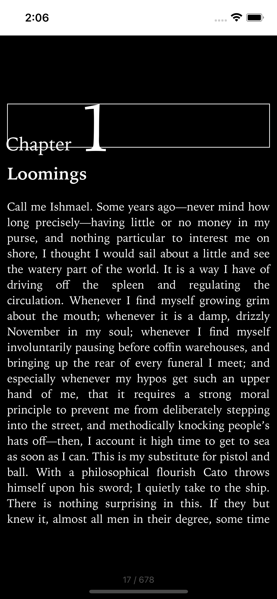
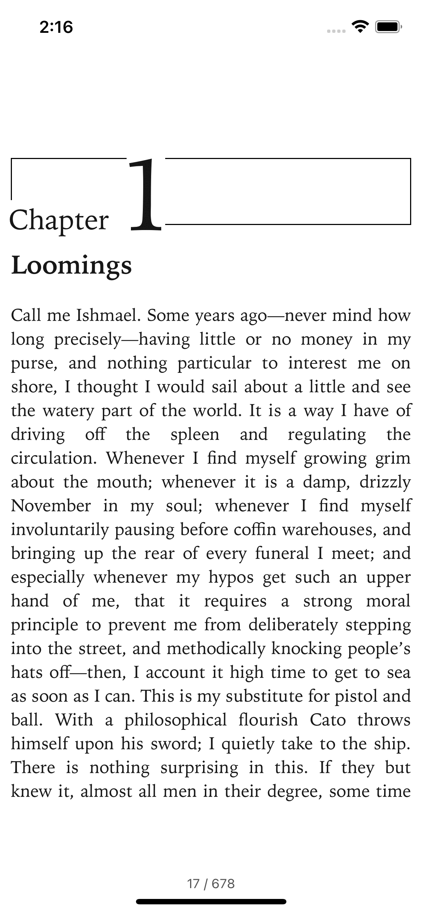

# react-native-readium

[](https://www.npmjs.com/package/react-native-readium)
[](http://commitizen.github.io/cz-cli/)


---

## Have a bug or feature you care about?

We :heart: open source. We work on the things that are important to us when we're able to work
on them. Have an issue you care about?

- [Dive into the code!](CONTRIBUTING.md)
- [Sponsor your issue](#sponsor-the-library)

---

## Overview

An ebook reader for React Native, built on the [Readium](https://readium.org/) toolkits, on iOS,
Android and web.

**[Read the documentation](https://5-stones.github.io/react-native-readium/)**

- Render EPUB 2, EPUB 3 and PDF publications in a `ReadiumView`.
- Track the reading position, and jump to any location, chapter or bookmark.
- Read the table of contents, positions and metadata.
- Control the reader: themes (light, dark, sepia), font size, margins and more.
- Highlights and notes, with custom text-selection actions.
- Full-text search.
- DRM: [Readium LCP](https://www.edrlab.org/readium-lcp/) through a companion package.

| Dark Mode                                          | Light Mode                                           |
| -------------------------------------------------- | ---------------------------------------------------- |
|  |  |

## Quick start

```sh
yarn add react-native-readium react-native-nitro-modules
```

| Platform | Requirements                                                                                                             |
| -------- | ------------------------------------------------------------------------------------------------------------------------ |
| iOS      | iOS 15.1+, Xcode 16.4+. Add Readium's spec repo and the `readium_pods` / `readium_post_install` helpers to your Podfile. |
| Android  | `compileSdkVersion` 31+, JDK 17, Kotlin 2.3.20+.                                                                         |
| Web      | `file.url` points to the `manifest.json` of an unpacked EPUB served over HTTP.                                           |

See [Installation](https://5-stones.github.io/react-native-readium/docs/getting-started/installation) for the
full setup on each platform.

```tsx
import { ReadiumView } from 'react-native-readium';

export function Reader({ path }: { path: string }) {
  return (
    <ReadiumView
      file={{ url: path }} // a local EPUB or PDF on native
      onLocationChange={(locator) => console.log(locator)}
      onPublicationReady={({ metadata, tableOfContents }) =>
        console.log(metadata.title, tableOfContents)
      }
    />
  );
}
```

The [documentation](https://5-stones.github.io/react-native-readium/) covers preferences, highlights,
search, LCP and the full API.

## Packages

| Package                                                           | Description                                                                                                           |
| ----------------------------------------------------------------- | --------------------------------------------------------------------------------------------------------------------- |
| [`react-native-readium`](./packages/react-native-readium)         | The reader: EPUB and PDF on iOS, Android and web.                                                                     |
| [`react-native-readium-lcp`](./packages/react-native-readium-lcp) | [Readium LCP](https://www.edrlab.org/readium-lcp/) DRM for iOS and Android, as a companion to `react-native-readium`. |

## Supported formats

| Format | Support            | Notes                       |
| ------ | ------------------ | --------------------------- |
| EPUB 2 | :white_check_mark: |                             |
| EPUB 3 | :white_check_mark: |                             |
| PDF    | :white_check_mark: | Scrolling, fitted to width. |
| CBZ    | :x:                | On the roadmap.             |

For LCP-protected publications, add
[`react-native-readium-lcp`](./packages/react-native-readium-lcp).

## Example apps

| App                                            | Description                             |
| ---------------------------------------------- | --------------------------------------- |
| [`apps/example-native`](./apps/example-native) | iOS and Android example, including LCP. |
| [`apps/example-nextjs`](./apps/example-nextjs) | Web example.                            |
| [`apps/common-app`](./apps/common-app)         | UI shared by both examples.             |

## Development

```sh
yarn                # install all workspaces
yarn typescript     # type-check every package
yarn test           # run every package's tests
yarn lint
yarn nitrogen       # regenerate Nitro bindings after editing a *.nitro.ts spec
yarn example ios    # or: yarn example android
yarn docs           # run the documentation site locally
```

Each package is released on its own from its directory with `yarn release`.

## Contributing

See the [contributing guide](CONTRIBUTING.md) for the development workflow.

## Sponsor the library

We work on what matters to us when we can. If you'd like to sponsor a feature, a fix, or the
library in general, open an issue and we'll talk.

## License

MIT
